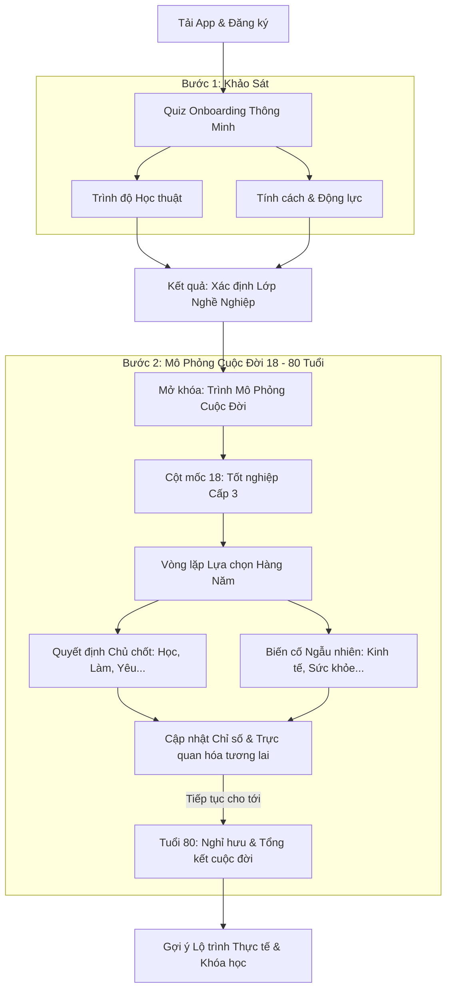

# Ngã Rẽ Cuộc Đời (Life's Crossroads) 🚀

> **Định hướng tương lai - Khai phá bản thân - Chọn đúng ngã rẽ**

Bản kế hoạch ý tưởng và tài liệu hướng dẫn phát triển dự án **Ngã Rẽ Cuộc Đời**, một nền tảng hướng nghiệp tương tác thế hệ mới dành riêng cho học sinh, sinh viên và người đi làm tại các quốc gia có xu hướng giáo dục & học tập chưa xác định rõ mục tiêu (như Việt Nam).

---

## 📌 1. Tầm Nhìn & Sứ Mệnh (Vision & Mission)

Tại Việt Nam và nhiều nước đang phát triển, áp lực từ gia đình, xã hội và sự thiếu thông tin thực tế dẫn đến tình trạng hàng triệu học sinh chọn ngành học theo trào lưu, dẫn đến tỷ lệ làm trái ngành cao hoặc mất phương hướng nghề nghiệp sau khi tốt nghiệp.

**Ngã Rẽ Cuộc Đời** ra đời nhằm giải quyết vấn đề này thông qua:
- **Cá nhân hóa lộ trình**: Kết hợp giữa trình độ học thuật hiện tại và tính cách thực tế để tìm ra nhóm ngành phù hợp nhất.
- **Phân loại lớp nghề nghiệp (Career Classification)**: Không chỉ dừng lại ở tên ngành, hệ thống phân loại người dùng vào các phân khúc nghề nghiệp thực tế có tính cập nhật cao.
- **Tương tác hóa trải nghiệm**: Giúp việc định hướng không còn khô khan nhờ cơ chế gamification (trò chơi hóa) và mô phỏng lộ trình nghề nghiệp.

---

## 🧩 2. Quy Trình Trải Nghiệm Khách Hàng (Mobile User Flow)

Dưới đây là sơ đồ luồng trải nghiệm trên ứng dụng di động:

---

## 🛠️ 3. Các Tính Năng Cốt Lõi (Core Features)

### 📋 3.1. Hệ Thống Quiz Onboarding Đa Chiều
Quiz onboarding không chỉ là những câu hỏi trắc nghiệm tâm lý đơn thuần mà kết hợp 3 trụ cột:
1. **Academic Quiz (Học thuật & Tư duy)**: Đánh giá thế mạnh học thuật tự nhiên (Toán/Logic, Ngôn ngữ, Nghệ thuật, Khoa học tự nhiên/xã hội).
2. **Personality & Behavioral Assessment (Tính cách & Hành vi)**: Tích hợp các bài trắc nghiệm uy tín đã được bản địa hóa phù hợp với văn hóa Đông Nam Á (như MBTI, Holland Codes - RIASEC, Big Five).
3. **Value & Motivation Survey (Giá trị cuộc sống)**: Tìm hiểu điều gì thúc đẩy người dùng (Tiền tài, Sự tự do, Đóng góp xã hội, Sự an toàn, Quyền lực).

### 🏷️ 3.2. Hệ Thống Phân Loại Lớp Nghề Nghiệp (Career Archetypes)
Dựa trên kết quả Quiz, người dùng sẽ được phân nhóm vào các **Lớp Nghề Nghiệp** sinh động giống như các hệ lớp nhân vật trong game nhập vai RPG:

| Lớp Nhân Vật | Đặc Điểm | Ví Dụ Nghề Nghiệp |
| :--- | :--- | :--- |
| **🧙‍♂️ Nhà Thông Thái (The Sage)** | Tư duy logic mạnh, thích nghiên cứu, phân tích dữ liệu và giải quyết bài toán khó. | AI Engineer, Data Scientist, Nhà nghiên cứu khoa học. |
| **🎨 Người Kiến Tạo (The Creator)** | Yêu thích cái đẹp, tư duy tự do, muốn thể hiện bản sắc cá nhân. | UI/UX Designer, Content Creator, Game Artist. |
| **🛡️ Người Bảo Vệ (The Guardian)** | Thích sự ổn định, quy trình rõ ràng, tính cẩn thận và tính tổ chức cao. | Chuyên viên tài chính, Kế toán, Quản trị hệ thống. |
| **🗣️ Kẻ Thuyết Phục (The Influencer)** | Khả năng giao tiếp xuất sắc, thích kết nối, truyền cảm hứng và dẫn dắt. | Product Manager, Marketing Specialist, PR, Sales. |
| **🛠️ Người Thực Thi (The Builder)** | Hành động thực tế, thích làm việc với công cụ, máy móc hoặc sản phẩm vật lý. | Kỹ sư cơ khí, Lập trình viên phần cứng, Kiến trúc sư. |

### 🎮 3.3. Trình Mô Phỏng Cuộc Đời Tương Tác 18 - 80 Tuổi (Life Simulator Engine)
Tính năng cốt lõi được xây dựng dạng game mô phỏng lựa chọn văn bản (Text-based Life Simulator) giúp người dùng trải nghiệm trước các ngã rẽ cuộc đời:

#### A. Chỉ Số Sinh Tồn & Phát Triển (Life Stats)
Mỗi quyết định của người dùng sẽ cập nhật 5 chỉ số động:
*   **❤️ Sức khỏe (Health)**: Suy giảm do làm việc quá sức, stress, tăng khi tập thể thao, nghỉ ngơi. Nếu về 0, trò chơi kết thúc sớm (lưu vong).
*   **💰 Tiền bạc (Wealth)**: Tích lũy từ đi làm, đầu tư, kinh doanh; tiêu tốn cho việc học, sinh hoạt, cưới hỏi hoặc trả nợ.
*   **🧠 Trí lực & Sự nghiệp (Career & Intellect)**: Trình độ chuyên môn, chức danh, kỹ năng mềm.
*   **😊 Hạnh phúc (Happiness)**: Mức độ thỏa mãn cuộc sống. Rơi vào trầm cảm sẽ ảnh hưởng tới sức khỏe và công việc.
*   **👥 Mối quan hệ (Social/Relationships)**: Tình cảm gia đình, bạn bè, đồng nghiệp và mạng lưới quan hệ (Networking).

#### B. Tuyến Trình Thời Gian & Điểm Quyết Định (Timeline & Choice Cards)
*   **Khởi đầu (Tuổi 18 - Tốt nghiệp Cấp 3)**: Người dùng đối mặt với ngã rẽ đầu tiên:
    *   *Lựa chọn A*: Học Đại học top đầu (Yêu cầu Học lực cao, tốn học phí, tăng Trí lực, Tiền bạc âm).
    *   *Lựa chọn B*: Học Cao đẳng/Nghề (Nhanh ra trường, học phí trung bình, sớm đi làm kiếm tiền).
    *   *Lựa chọn C*: Đi làm ngay làm công nhân/lao động tự do (Có tiền ngay, nhưng giới hạn mức tăng trưởng sự nghiệp lâu dài).
    *   *Lựa chọn D*: Khởi nghiệp / Gap year (Rủi ro cực cao, dễ mất sạch tiền nhưng tiềm năng bứt phá).
*   **Vòng lặp mỗi năm (Age 19 - 79)**: 
    *   Mỗi năm trôi qua, hệ thống sẽ đưa ra **1 Quyết định chủ chốt** (Ví dụ: nhảy việc, học thạc sĩ, mua nhà trả góp, kết hôn, sinh con) và **1 Biến cố ngẫu nhiên** (Kinh tế suy thoái cắt giảm nhân sự, ốm nặng, trúng số, bạn bè lừa đảo đầu tư coin...).
*   **Kết thúc (Tuổi 80 - Nghỉ hưu & Hồi tưởng)**:
    *   Ứng dụng hiển thị một **"Life Report"** cực kỳ chi tiết phân tích xem các lựa chọn năm 18 tuổi và các ngã rẽ sau đó đã dẫn đến kết quả gì.
    *   So sánh cuộc đời ảo đó với mong muốn thực tế để rút ra bài học: *"Nếu bạn muốn có một cuộc sống an nhàn, hướng đi A của bạn ở tuổi 25 đã quá mạo hiểm"*.

#### C. Học Tập Chủ Động Từ Thực Tế (Actionable Insights)
*   Từ kết quả mô phỏng, app đề xuất các tài liệu, khoá học và lộ trình thực tế để người dùng đạt được "kịch bản tốt nhất" ngoài đời thực.

---

## 📈 4. Lý Do Ý Tưởng Này Sẽ Bùng Nổ (Market Validation)

1.  **Nỗi đau thị trường cực lớn tại Việt Nam & Đông Nam Á**:
    *   Tình trạng học sinh "chọn bừa" ngành do áp lực từ cha mẹ hoặc theo xu hướng đám đông.
    *   Học sinh THPT hoàn toàn thiếu thông tin thực tế về việc "làm nghề đó là làm gì hàng ngày".
2.  **Tính cá nhân hóa & Thừa nhận bản sắc cá nhân**:
    *   Thế hệ trẻ (Gen Z, Gen Alpha) có xu hướng muốn hiểu sâu về bản thân và đòi hỏi sự tự do lựa chọn cao hơn thế hệ trước.
3.  **Yếu tố Gamification dễ lan tỏa (Viral potential)**:
    *   Việc chia sẻ "Lớp nhân vật nghề nghiệp" của mình lên mạng xã hội (Facebook, TikTok, Instagram) giống như cách Spotify Wrapped hay các trend MBTI lan truyền sẽ tạo ra lượng organic traffic khổng lồ.

---

## 🚀 5. Lộ Trình Phát Triển Đề Xuất (Roadmap)

### Phase 1: Khởi động & Validate (MVP)
*   Xây dựng Landing Page giới thiệu ý tưởng.
*   Thiết kế bộ câu hỏi Onboarding Quiz rút gọn (15 - 20 câu).
*   Xây dựng thuật toán phân loại cơ bản ra 5-6 nhóm nghề nghiệp chính.
*   Thu thập phản hồi từ 1000 người dùng thử nghiệm đầu tiên.

### Phase 2: Phát triển Sản phẩm chính thức
*   Thiết kế giao diện Web App cao cấp (Dark mode, hiệu ứng chuyển động mượt mà, giao diện dạng thẻ tương tác).
*   Mở rộng cơ sở dữ liệu nghề nghiệp chi tiết tại Việt Nam (mức lương trung bình, lộ trình thăng tiến, khó khăn của nghề).
*   Tích hợp hệ thống phân tích AI để đưa ra nhận xét cá nhân hóa chi tiết.

### Phase 3: Hệ sinh thái & Kết nối
*   Tích hợp tính năng kết nối Mentor (người đi trước chia sẻ kinh nghiệm).
*   Hợp tác với các trường đại học, trung tâm đào tạo để cung cấp khóa học.
*   Hợp tác với các doanh nghiệp để tuyển dụng thực tập sinh dựa trên lớp tính cách phù hợp.

---

## 🎨 6. Định Hướng Thiết Kế Giao Diện (Design System - UI/UX)

Để thu hút giới trẻ, giao diện cần mang phong cách **Futuristic / Cyberpunk** kết hợp **Glassmorphism**:
*   **Tone màu chủ đạo**: Tối (Dark mode làm nền) để nổi bật các dải neon (Cyan 🔵, Neon Purple 🟣, Electric Pink 🔴) biểu thị cho các ngã rẽ cuộc đời khác nhau.
*   **Fonts**: Dùng font chữ hiện đại như *Space Grotesk*, *Inter* hoặc *Outfit*.
*   **Micro-interactions**: Khi người dùng hover vào một "ngã rẽ", bản đồ sẽ phát sáng và hiển thị các thông tin nhanh về nghề nghiệp đó.

---
*Bản kế hoạch được khởi tạo vào tháng 6/2026. Hãy cùng phát triển để thay đổi tương lai của thế hệ trẻ!*
