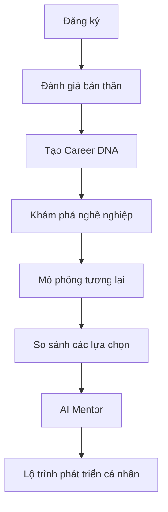

# 🚀 NGÃ RẼ CUỘC ĐỜI (LIFE'S CROSSROADS)

## Nền tảng mô phỏng tương lai nghề nghiệp bằng AI dành cho thế hệ trẻ Việt Nam

> **"Đừng hỏi ngành nào hot. Hãy hỏi con đường nào phù hợp với chính bạn."**

---

# 1. TÓM TẮT DỰ ÁN

**Ngã Rẽ Cuộc Đời** là nền tảng hướng nghiệp thế hệ mới kết hợp giữa:

* AI Career Assessment
* Career Simulation Engine
* Life Decision Modeling
* Personalized Learning Roadmap

Thay vì chỉ trả lời:

> "Bạn phù hợp với ngành Công nghệ thông tin."

Hệ thống sẽ cho người dùng trải nghiệm:

> "Nếu tôi chọn CNTT, học như thế nào, phát triển ra sao, thu nhập thế nào, rủi ro gì và cuộc sống thay đổi như thế nào trong 5–15 năm tới?"

Đây là sự kết hợp giữa:

* Hướng nghiệp
* Dữ liệu nghề nghiệp
* AI cố vấn
* Mô phỏng tương lai

trong một trải nghiệm tương tác duy nhất.

---

# 2. VẤN ĐỀ THỊ TRƯỜNG

## Thực trạng

Mỗi năm tại Việt Nam:

* Hơn 1 triệu học sinh đứng trước lựa chọn ngành học.
* Nhiều sinh viên không hiểu rõ nghề nghiệp mình sẽ làm.
* Tỷ lệ làm trái ngành cao.
* Nhiều người mất 3–5 năm đầu sự nghiệp để tìm lại hướng đi phù hợp.

Nguyên nhân:

### Thiếu hiểu bản thân

Không biết:

* Mình giỏi gì
* Mình thích gì
* Mình phù hợp môi trường nào

### Thiếu hiểu nghề nghiệp

Không biết:

* Công việc thực tế là gì
* Thu nhập ra sao
* Áp lực như thế nào
* Cơ hội phát triển thực tế

### Không nhìn thấy hậu quả của quyết định

Người trẻ chỉ thấy:

> "Ngành này đang hot."

Nhưng không thấy:

> "Nếu chọn ngành này thì 10 năm nữa mình sẽ như thế nào?"

---

# 3. TẦM NHÌN

Trở thành nền tảng định hướng nghề nghiệp cá nhân hóa hàng đầu Đông Nam Á.

Giúp người trẻ:

* Hiểu bản thân
* Hiểu nghề nghiệp
* Hiểu hệ quả của lựa chọn
* Xây dựng lộ trình phát triển dài hạn

---

# 4. ĐỊNH VỊ SẢN PHẨM

Nếu MBTI giúp bạn hiểu tính cách.

Nếu LinkedIn giúp bạn tìm việc.

Nếu Coursera giúp bạn học kỹ năng.

Thì:

> **Ngã Rẽ Cuộc Đời giúp bạn nhìn thấy tương lai nghề nghiệp trước khi đưa ra quyết định.**

---

# 5. HÀNH TRÌNH NGƯỜI DÙNG



---

# 6. CAREER DNA SYSTEM

Đây là nền tảng cốt lõi.

Không sử dụng MBTI đơn thuần.

Mà kết hợp:

* Holland RIASEC
* Big Five
* Learning Style
* Career Motivation
* Academic Strength

---

## Kết quả

Ví dụ:

### Hồ sơ Career DNA

```text
Logic & Phân tích       88%
Sáng tạo                72%
Giao tiếp               54%
Lãnh đạo                61%
Kỷ luật                 85%
Khả năng thích nghi     76%
```

---

## Archetype

### Technology Builder

Bạn phù hợp với:

* Software Engineer
* Mobile Developer
* AI Engineer
* Data Analyst

---

# 7. CAREER EXPLORER

Người dùng có thể khám phá hàng trăm nghề.

Mỗi nghề gồm:

## Công việc thực tế

Một ngày làm việc điển hình.

---

## Thu nhập

* Intern
* Fresher
* Junior
* Middle
* Senior
* Manager

---

## Yêu cầu kỹ năng

* Kỹ năng chuyên môn
* Kỹ năng mềm
* Ngoại ngữ

---

## Chỉ số nghề nghiệp

| Tiêu chí            | Điểm |
| ------------------- | ---- |
| Áp lực              | 7/10 |
| Cạnh tranh          | 8/10 |
| Cơ hội quốc tế      | 9/10 |
| Nguy cơ AI thay thế | 4/10 |
| Work-life balance   | 6/10 |

---

# 8. CAREER SIMULATION ENGINE

## Tính năng độc quyền

Người dùng có thể mô phỏng tương lai của mình.

Ví dụ:

### Mục tiêu

Trở thành Software Engineer.

---

## Năm 1

Lựa chọn:

* Đại học
* Cao đẳng
* Tự học

---

## Năm 2

Lựa chọn:

* Học Flutter
* Học Web
* Học AI

---

## Năm 3

Lựa chọn:

* Thực tập Startup
* Outsourcing
* Product Company

---

## Năm 5

Kết quả mô phỏng:

```text
Thu nhập: 18 triệu

Kinh nghiệm: 3 năm

Kỹ năng: 67/100

Khả năng tuyển dụng: Cao
```

---

# 9. CONSEQUENCE ENGINE

Đây là phần quan trọng nhất.

Ứng dụng KHÔNG sử dụng random vô lý.

Thay vào đó:

## Mọi sự kiện đều có nguyên nhân

---

Ví dụ:

### Người dùng

* Không học tiếng Anh
* Không cập nhật công nghệ

---

Sau 5 năm:

```text
Khả năng tuyển dụng giảm

Thu nhập thấp hơn thị trường

Khó tiếp cận cơ hội quốc tế
```

---

Ví dụ:

### Người dùng

* Làm việc 70 giờ/tuần
* Ngủ dưới 5 giờ/ngày
* Không nghỉ phép

---

Sau nhiều năm:

```text
Nguy cơ Burnout tăng

Hiệu suất giảm

Rủi ro sức khỏe cao
```

---

Mục tiêu:

Cho người dùng hiểu:

> Hậu quả đến từ lựa chọn.

Không phải từ may rủi.

---

# 10. FUTURE COMPARISON

Cho phép so sánh nhiều tương lai khác nhau.

Ví dụ:

| Tiêu chí              | CNTT       | Dược       | Marketing  |
| --------------------- | ---------- | ---------- | ---------- |
| Thời gian học         | 4 năm      | 5 năm      | 4 năm      |
| Thu nhập năm 5        | 20 triệu   | 12 triệu   | 18 triệu   |
| Áp lực                | Cao        | Trung bình | Cao        |
| Cơ hội quốc tế        | Rất cao    | Thấp       | Trung bình |
| Khả năng AI ảnh hưởng | Trung bình | Thấp       | Cao        |

---

# 11. AI CAREER MENTOR

Người dùng có thể trò chuyện với AI.

Ví dụ:

> Em thích máy tính nhưng không giỏi toán.

AI sẽ phân tích:

* Điểm mạnh
* Điểm yếu
* Rủi ro
* Nghề phù hợp
* Nghề không phù hợp

Sau đó xây dựng:

## Roadmap cá nhân hóa

Ví dụ:

```text
2027:
Học HTML/CSS

2028:
Học Flutter

2029:
Thực tập

2030:
Junior Developer
```

---

# 12. CAREER JOURNEY

Sau khi mô phỏng.

Người dùng có thể chuyển sang chế độ:

## Theo dõi thực tế

Ứng dụng biến thành người đồng hành.

Theo dõi:

* Kỹ năng đã học
* Chứng chỉ đạt được
* GPA
* Tiếng Anh
* Dự án cá nhân
* Thực tập

---

# 13. TÍNH NĂNG VIRAL

## Future Career Card

Ví dụ:

```text
Bạn thuộc nhóm:

TECH BUILDER

Top 8% phù hợp ngành Công nghệ

Khả năng thành công:
81%
```

---

## Future Snapshot

```text
Năm 2035

Nghề nghiệp:
Senior Mobile Developer

Thu nhập dự kiến:
45 triệu/tháng

Điều kiện:
Duy trì học tập liên tục
Tiếng Anh B2+
3 lần chuyển việc chiến lược
```

Có thể chia sẻ lên:

* TikTok
* Facebook
* Instagram

---

# 14. MÔ HÌNH KINH DOANH

### Freemium

Miễn phí:

* Career DNA
* Top nghề phù hợp

Premium:

* Career Simulation
* AI Mentor
* Future Comparison
* Career Roadmap

---

### B2B

Khách hàng:

* Trường THPT
* Trường Đại học
* Trung tâm hướng nghiệp

---

### B2C

* Mentor 1:1
* Khóa học
* CV Review
* Mock Interview

---

# 15. TẦM NHÌN DÀI HẠN

Trong 10 năm tới, mục tiêu không phải là tạo ra một ứng dụng trắc nghiệm nghề nghiệp.

Mục tiêu là xây dựng:

> **Bản đồ tương lai nghề nghiệp cá nhân đầu tiên dành cho người Việt.**

Một nơi mà bất kỳ học sinh nào trước khi quyết định ngành học, trường học hay công việc đều có thể:

* Nhìn thấy các con đường phía trước.
* Hiểu được cái giá và cơ hội của từng lựa chọn.
* Xây dựng kế hoạch phát triển phù hợp với chính mình.

**Ngã Rẽ Cuộc Đời không giúp người dùng đoán tương lai.
Ngã Rẽ Cuộc Đời giúp người dùng tạo ra tương lai tốt hơn.**
